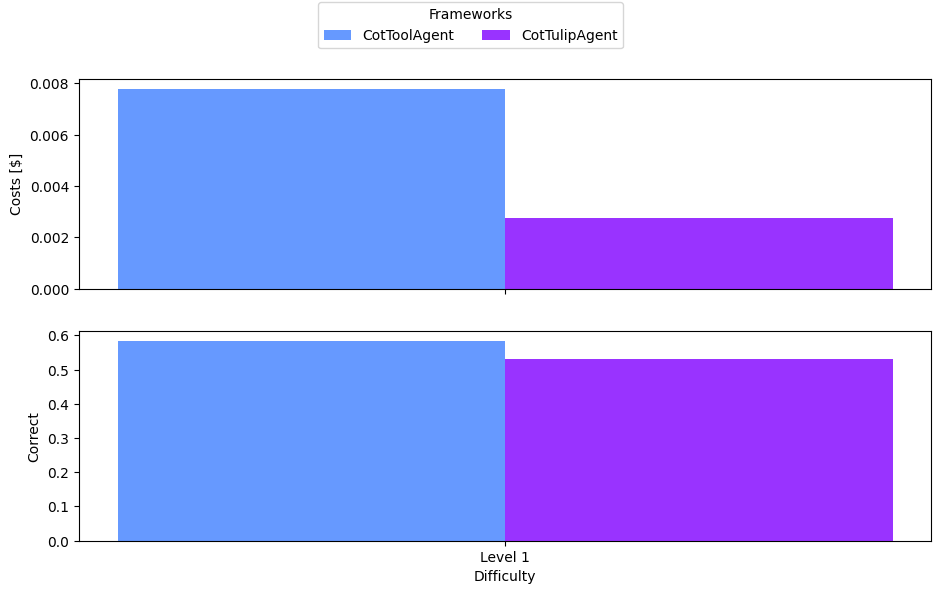

# math_eval

# Instructions
1. Specify settings in `math_eval_settings.yaml`
   * Agent ablations to include
   * Tools module to be used
2. Run the evaluation with `math_eval.py`
3. Analyze results and plot with `log_analysis.py`; uses the latest log file unless one is specified in `math_eval_settings.yaml`

## Results

Note: To avoid a bias towards the tulip architecture, the costs for creating the tool library
are currently added to the embeddings costs of **every single** query, even though it could be reused
