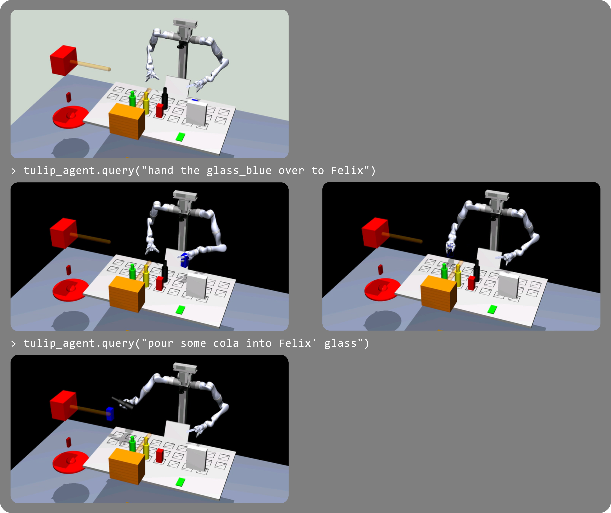

# robo eval

## Setup
1. Clone the AttentiveSupport repo: `git@github.com:HRI-EU/AttentiveSupport.git` - it comes with a simulator and python bindings for tools
2. Build the AttentiveSupport repo: `cd AttentiveSupport && bash build.sh`
3. Copy the extended tools to the robo_eval directory: `cp src/tools.py ../tools.py`
4. Adapt the paths in the system setup in `tools.py` as follows:
    ```python
    with open(Path(__file__).parent.resolve() / "AttentiveSupport" / "src" / "config.yaml", "r") as config:
        config_data = yaml.safe_load(config)
        SMILE_WS_PATH = Path(__file__).parent.resolve() / "AttentiveSupport" / config_data["install"]
        print(f"{SMILE_WS_PATH=}")
    ```
5. Run in interactive mode from `robo_eval`: `python -i robo_eval.py`
6. Run an example: `auto_tulip_agent.query("hand the glass_blue over to Felix")`

## Example


